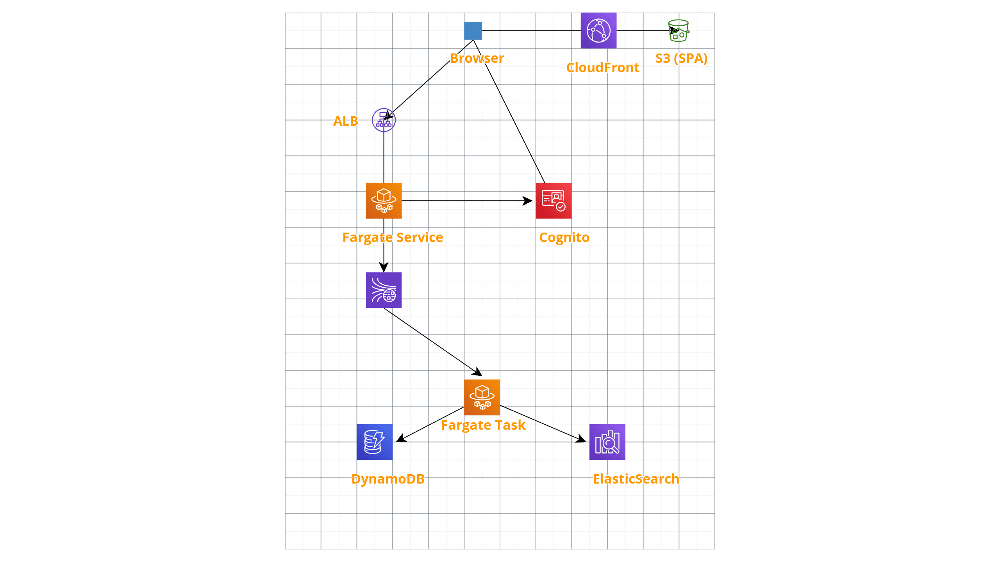

# Collection of useful CDK Stacks

### Author: Vladimir Budilov
* [YouTube](https://www.youtube.com/channel/UCBl-ENwdTlUsLY05yGgXyxw)
* [LinkedIn](https://www.linkedin.com/in/vbudilov/)
* [Medium](https://medium.com/@budilov)
* [Twitter](https://twitter.com/VladimirBudilov)



#### Why
I create apps and deployments all of the time. I use different tools for different scenarios. Sometimes I use the Serverless framework
to deploy Lambda functions, sometimes SAM. In some cases I used Terraform to create other resources, and it others I just did it manually. 
This project is going to help me (and hopefully you) to automate some of those resource creations.

The idea is to build out an app (details will come later) that facilitates data ingestion using Kinesis, EKS, DDB, and other 
popular AWS services.

#### What does it do now
- [x] Cognito Stack
- [x] Cognito Stack Lambda Triggers
- [x] DynamoDB Users & Ticker Table
- [x] ElasticSearch service
- [x] IAM role to access Elasticsearch
- [x] Kinesis Stream
- [x] ECS Fargate Service
- [x] ECS Fargate Service IAM roles
- [x] ECR Repos
- [x] Saving endpoints into the Parameter Store (for discovery)
- [ ] S3 Bucket (for SPA hosting)

#### Deployment
```
# You'll need to package and syth every time you make code changes
mvn package && cdk synth

# this step should be done once, but only after your first 'mvn package'
cdk bootstrap

# After the code is built and cdk synth is run, deploy to your account
# first create the ECR stack. After this step is created make sure you deploy
# a valid docker image to the 'data-ingest-gateway' repo, otherwise the ECS stack
# won't deploy (it'll wait for a valid image to show up in that ECR repo)
cdk deploy "TickerEcrStack"

# Then deploy all of the other Stacks
cdk deploy "TickerDDBTables"
cdk deploy "TickerKinesisStreams"
cdk deploy "TickerCognitoLambdaStack"
cdk deploy "TickerCognitoUP"
cdk deploy "TickerESIAM"
cdk deploy "TickerES"
cdk deploy "TickerEcsIamStack"
cdk deploy "TickerEcsStack"

```

###### Useful commands

 * `mvn package`     compile and run tests
 * `cdk ls`          list all stacks in the app
 * `cdk synth`       emits the synthesized CloudFormation template
 * `cdk deploy`      deploy this stack to your default AWS account/region
 * `cdk diff`        compare deployed stack with current state
 * `cdk docs`        open CDK documentation
